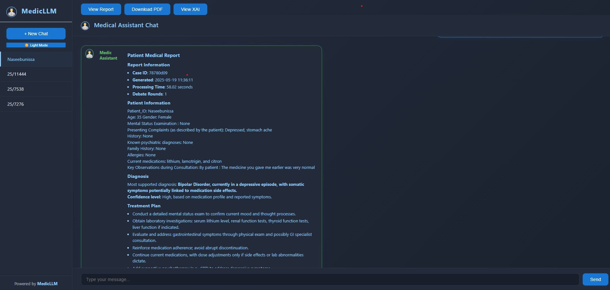
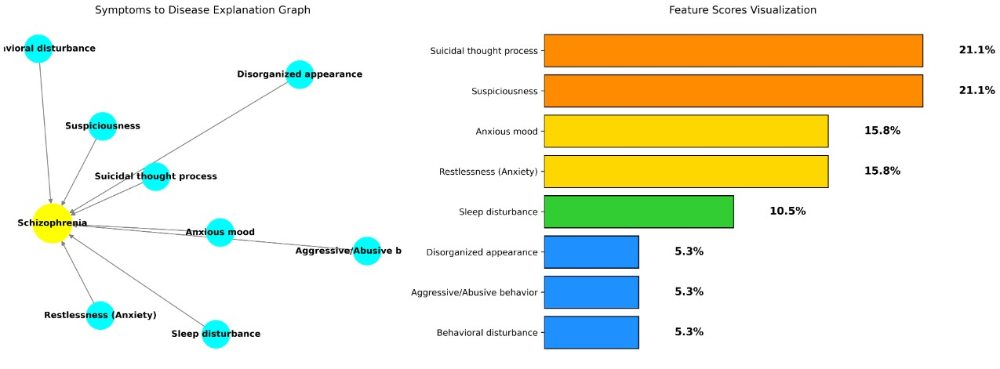

# 🚀 MedicLLM — AI Assistant for Psychiatric Diseases



I'm proud to share the outcome of my latest research project, developed and tested at Lokmanya Tilak Municipal Medical College & Hospital (Sion Hospital) under the mentorship of the University of Mumbai CS Department.

---

## 🔍 What is MedicLLM?

**MedicLLM** is an AI-powered assistant designed to support psychiatric diagnosis and treatment planning. The system is built around an argumentative multi-agent framework, where each agent specializes in tasks like:

- 🧠 **Diagnosis**
- 💊 **Medicine Recommendation**
- 📝 **Treatment Planning**

To ensure trust and interpretability, it integrates an **Explainable AI (XAI)** framework that helps clinicians understand the reasoning behind the model's suggestions.

---

## 🛠️ Tech Stack

- **Django** for backend logic
- **Langchain** and **OpenAI** for multi-agent LLM orchestration
- **Qdrant Server** as a vector DB for semantic search
- **Docker** for containerized deployment

---

## ✨ Features

- **Multi-Agent Argumentative Reasoning**: Each agent (Diagnosis, Drug, Treatment) debates and synthesizes the best clinical plan.
- **Explainable AI (XAI)**: Visual explanations and debate graphs for transparency.
- **Modern Medical Chat UI**: ChatGPT-style interface tailored for clinical workflows.
- **Session Management**: Persistent chat sessions, downloadable patient reports, and XAI visualizations.
- **Admin Panel**: Full audit and management of all cases and messages.
- **Dark/Light Mode**: Professional, accessible UI for all environments.

---

## 🖥️ Demo

### Webapp Walkthrough

[![Watch the video]](https://youtu.be/DmLgPgzHKw0)


---

### XAI Visualization Example



---

## 🚦 Quick Start

1. **Clone the repo:**
   ```sh
   git clone https://github.com/Tobaisfire/MedicalLLM-webapp.git
   cd MedicLLM
   ```
2. **Install dependencies:**
   ```sh
   pip install -r requirements.txt
   ```
3. **Set up environment:**
   - Add your OpenAI API key and other secrets to `.env`.
4. **Run Qdrant server** (see [Qdrant docs](https://qdrant.tech/documentation/))
5. **Start Django server:**
   ```sh
   cd medicalwebapp
   python manage.py migrate
   python manage.py runserver
   ```
6. **Access the app:**
   - Open [http://localhost:8000](http://localhost:8000)

---

## 📄 Example Patient Report

- Downloadable as PDF or viewable in-browser after each session.
- Includes diagnosis, treatment, medication, and XAI debate analysis.

---

## 🤝 Acknowledgements

- Lokmanya Tilak Municipal Medical College & Hospital (Sion Hospital)
- University of Mumbai CS Department
- [Langchain](https://www.langchain.com/), [OpenAI](https://openai.com/), [Qdrant](https://qdrant.tech/)

---

## 📬 Contact

For questions, collaborations, or feedback:
- [Keval Saud](mailto:kevalsaud25@gmail.com)
- [LinkedIn](https://www.linkedin.com/in/keval-sing-saud-1945231b2/)

---

> **MedicLLM** — Advancing AI for clinical psychiatry, with trust and transparency at its core. 