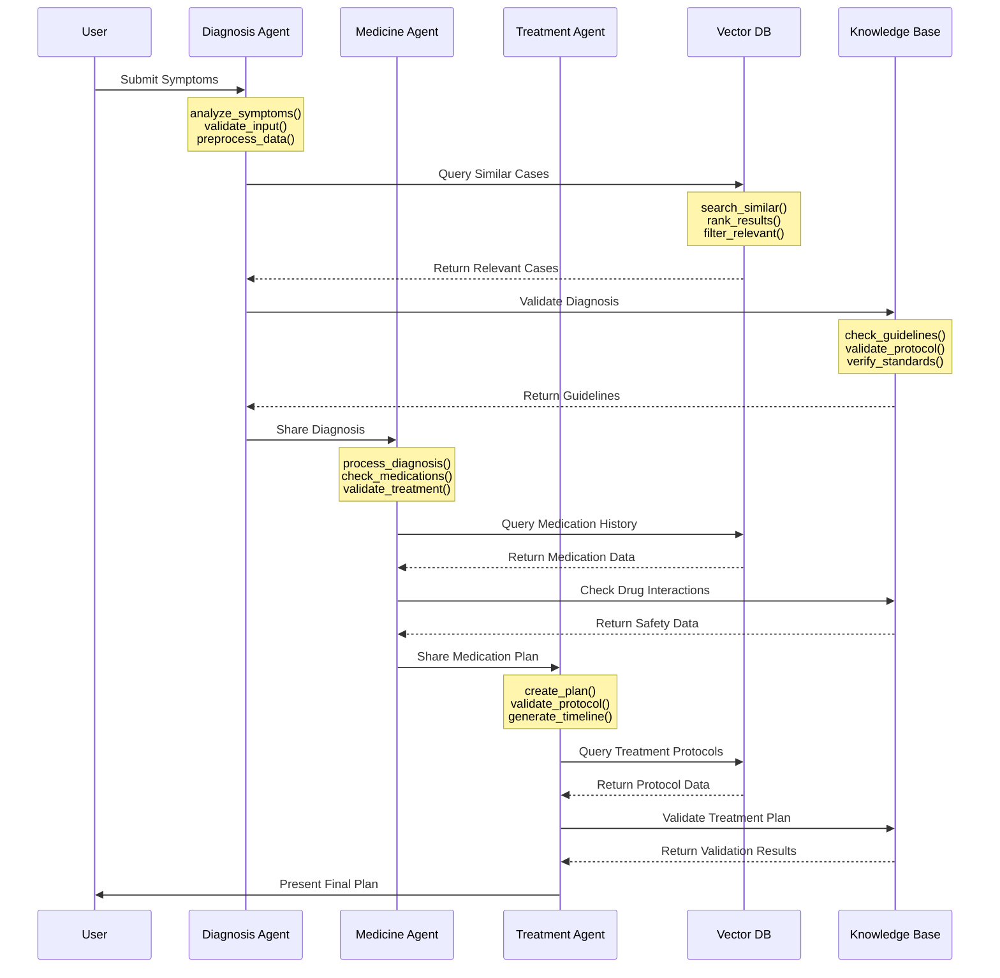

# MedicLLM System Architecture

## System Overview

This document provides detailed system architecture diagrams and data flow documentation for the MedicLLM project.

## Architecture Diagrams

### 1. High-Level System Architecture
```mermaid
flowchart TB
    subgraph "Data Sources"
        Books[Medical Books Database<br/>- load_medical_books()<br/>- extract_medical_terms()<br/>- parse_clinical_guidelines()]
        MedQA[MedQA Dataset<br/>- load_medqa_data()<br/>- process_qa_pairs()<br/>- extract_case_studies()]
        Synth[Synthetic Data Generator<br/>- generate_medical_cases()<br/>- simulate_patient_data()<br/>- create_edge_cases()]
    end

    subgraph "Vector Database"
        Qdrant[(Qdrant Vector DB<br/>- store_embeddings()<br/>- search_similar()<br/>- update_vectors())]
        Embeddings[Embedding Store<br/>- generate_embeddings()<br/>- cache_embeddings()<br/>- manage_metadata()]
    end

    subgraph "Agent System"
        Base[Base Agent<br/>- initialize_llm()<br/>- setup_chain()<br/>- manage_context()]
        Diag[Diagnosis Agent<br/>- analyze_symptoms()<br/>- validate_diagnosis()<br/>- generate_hypothesis()]
        Med[Medicine Agent<br/>- check_interactions()<br/>- recommend_medication()<br/>- validate_dosage()]
        Treat[Treatment Agent<br/>- create_treatment_plan()<br/>- validate_protocol()<br/>- monitor_progress()]
    end

    subgraph "Data Processing"
        Preprocess[Data Preprocessing<br/>- clean_text()<br/>- normalize_terms()<br/>- validate_format()]
        Embed[Text Embedding<br/>- tokenize_text()<br/>- generate_vectors()<br/>- optimize_embeddings()]
        Index[Vector Indexing<br/>- create_index()<br/>- update_index()<br/>- optimize_search()]
    end

    subgraph "Knowledge Base"
        KB[Knowledge Graph<br/>- build_graph()<br/>- query_relationships()<br/>- update_knowledge()]
        Rules[Clinical Rules<br/>- validate_rules()<br/>- apply_guidelines()<br/>- check_compliance()]
        Guidelines[Medical Guidelines<br/>- load_guidelines()<br/>- validate_protocols()<br/>- update_standards()]
    end

    %% Data Source Connections
    Books --> Preprocess
    MedQA --> Preprocess
    Synth --> Preprocess

    %% Processing Flow
    Preprocess --> Embed
    Embed --> Index
    Index --> Qdrant

    %% Agent Interactions
    Base --> Qdrant
    Base --> KB
    Base --> Rules
    Base --> Guidelines

    Diag --> Base
    Med --> Base
    Treat --> Base

    %% Agent Communication
    Diag <--> Med
    Med <--> Treat
    Treat <--> Diag

    %% Output Flow
    Diag --> Report[Patient Report<br/>- generate_report()<br/>- format_findings()<br/>- export_pdf()]
    Med --> Report
    Treat --> Report

    %% XAI Components
    Report --> XAI[Explainable AI<br/>- explain_decisions()<br/>- track_reasoning()<br/>- validate_confidence()]
    XAI --> Viz[Visualization<br/>- create_graphs()<br/>- generate_charts()<br/>- export_visuals()]
```

### 2. Agent Communication Flow


### 3. Data Source Integration
```mermaid
flowchart TB
    subgraph "Data Sources"
        Books[Medical Books<br/>- load_books()<br/>- extract_content()<br/>- parse_structure()]
        MedQA[MedQA Dataset<br/>- load_dataset()<br/>- process_qa()<br/>- extract_cases()]
        Synth[Synthetic Data<br/>- generate_cases()<br/>- validate_data()<br/>- create_scenarios()]
    end

    subgraph "Processing Pipeline"
        Clean[Data Cleaning<br/>- remove_noise()<br/>- standardize_format()<br/>- validate_content()]
        Format[Format Standardization<br/>- normalize_text()<br/>- structure_data()<br/>- validate_schema()]
        Validate[Validation<br/>- check_quality()<br/>- verify_accuracy()<br/>- validate_consistency()]
    end

    subgraph "Vector DB Integration"
        Embed[Embedding Generation<br/>- tokenize()<br/>- generate_vectors()<br/>- optimize_embeddings()]
        Store[Vector Storage<br/>- store_vectors()<br/>- index_data()<br/>- manage_metadata()]
        Index[Indexing<br/>- create_index()<br/>- optimize_search()<br/>- update_vectors()]
    end

    Books --> Clean
    MedQA --> Clean
    Synth --> Clean

    Clean --> Format
    Format --> Validate
    Validate --> Embed
    Embed --> Store
    Store --> Index
```

### 4. Knowledge Base Integration
```mermaid
flowchart TB
    subgraph "Knowledge Sources"
        Books[Medical Literature<br/>- load_literature()<br/>- extract_knowledge()<br/>- parse_publications()]
        Guidelines[Clinical Guidelines<br/>- load_guidelines()<br/>- extract_rules()<br/>- parse_protocols()]
        Research[Research Papers<br/>- load_papers()<br/>- extract_findings()<br/>- parse_methodologies()]
    end

    subgraph "Knowledge Processing"
        Extract[Information Extraction<br/>- extract_entities()<br/>- identify_relationships()<br/>- parse_metadata()]
        Structure[Knowledge Structuring<br/>- build_ontology()<br/>- create_taxonomy()<br/>- organize_concepts()]
        Validate[Knowledge Validation<br/>- verify_accuracy()<br/>- check_consistency()<br/>- validate_sources()]
    end

    subgraph "Knowledge Base"
        Graph[Knowledge Graph<br/>- build_graph()<br/>- query_relationships()<br/>- update_knowledge()]
        Rules[Clinical Rules<br/>- validate_rules()<br/>- apply_guidelines()<br/>- check_compliance()]
        Ontology[Medical Ontology<br/>- build_ontology()<br/>- manage_terms()<br/>- update_classifications()]
    end

    Books --> Extract
    Guidelines --> Extract
    Research --> Extract

    Extract --> Structure
    Structure --> Validate
    Validate --> Graph
    Validate --> Rules
    Validate --> Ontology
```

## Data Sources

### 1. Medical Books Database
- Comprehensive medical literature
- Clinical guidelines
- Treatment protocols
- Drug information
- Medical terminology
- Case studies

### 2. MedQA Dataset
- Medical question-answering pairs
- Clinical case studies
- Patient scenarios
- Expert annotations
- Treatment outcomes
- Drug interactions

### 3. Synthetic Data Generator
- AI-generated medical cases
- Simulated patient interactions
- Treatment outcomes
- Drug response patterns
- Rare case scenarios
- Edge cases

## Vector Database Integration

### Qdrant Configuration
```python
from qdrant_client import QdrantClient
from qdrant_client.http import models

client = QdrantClient("localhost", port=6333)

# Collection configuration
client.create_collection(
    collection_name="medical_knowledge",
    vectors_config=models.VectorParams(
        size=1536,  # OpenAI embedding dimension
        distance=models.Distance.COSINE
    )
)
```

### Data Indexing Process
```python
def index_medical_data(text, metadata):
    # Generate embeddings
    embedding = generate_embedding(text)
    
    # Store in Qdrant
    client.upsert(
        collection_name="medical_knowledge",
        points=[
            models.PointStruct(
                id=generate_id(),
                vector=embedding,
                payload=metadata
            )
        ]
    )
```

## Agent System

### 1. Diagnosis Agent
- Queries vector DB for similar cases
- Consults medical guidelines
- Generates initial diagnosis
- Shares findings with Medicine Agent
- Validates against knowledge base
- Maintains diagnosis history

### 2. Medicine Agent
- Reviews diagnosis
- Checks drug interactions
- Considers patient history
- Proposes medication plan
- Collaborates with Treatment Agent
- Validates against drug database
- Monitors side effects

### 3. Treatment Agent
- Integrates diagnosis and medication
- Develops comprehensive plan
- Validates against guidelines
- Generates final recommendations
- Creates treatment timeline
- Monitors progress metrics
- Adjusts plan as needed

## Knowledge Base Integration

### 1. Knowledge Graph
- Medical concepts
- Relationships between conditions
- Treatment pathways
- Drug interactions
- Patient history patterns

### 2. Clinical Rules
- Treatment protocols
- Drug administration guidelines
- Safety checks
- Contraindications
- Best practices

### 3. Medical Ontology
- Standardized terminology
- Classification systems
- Medical hierarchies
- Cross-references
- Semantic relationships

## Data Flow Process

1. **Data Ingestion**
   - Collect data from multiple sources
   - Validate data format and content
   - Clean and preprocess data
   - Standardize terminology

2. **Knowledge Processing**
   - Extract relevant information
   - Structure knowledge
   - Validate against standards
   - Update knowledge base

3. **Vector Database Integration**
   - Generate embeddings
   - Index data
   - Store metadata
   - Maintain relationships

4. **Agent Processing**
   - Query relevant information
   - Process through agents
   - Validate decisions
   - Generate recommendations

5. **Output Generation**
   - Create patient reports
   - Generate visualizations
   - Provide explanations
   - Document decisions

---

*This system architecture documentation is maintained by the MedicLLM development team. Last updated: [Current Date]* 